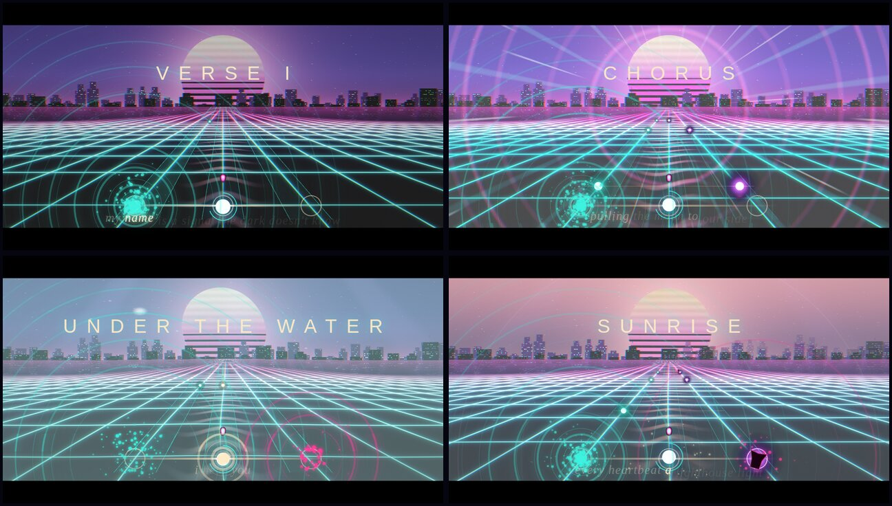

# Neon Tide

A synthwave rhythm game that is also a 2:34 music video. Open `index.html` in a
browser; it is one self-contained file with no network requests (the moodboard
links are plain links out).

- **Play** — three lanes on a neon ocean. ←/→ or A/D to move, Space to hit,
  Shift for Tide Mode, Esc to pause. Tap left/right half of the screen on a phone.
- **Watch** — the same song as a letterboxed music video; the light-spirit
  dances through every note on its own, with lyrics as subtitles.
- **Moodboard** — the palette (click a swatch to copy its hex) and eight
  reference boards.

The whole song is synthesized live with Web Audio: 100 BPM in F minor, 64 bars,
nine instruments on a look-ahead scheduler, with the beatmap generated from the
same note data so every orb lands on the audio clock.

## Who made what

Claude directed and Pokee Isaac generated, through the `build`, `iterate` and
`ask` tools in this repo.

| Part | By |
| --- | --- |
| Concept, song structure, chords, lyrics, moodboard, every spec | Claude |
| First full build: audio engine, sequencer, game state, menus, HUD, moodboard UI | Isaac (`build`) |
| Fragment shader: sky, stars, section effects, underwater, chorus streaks | Isaac (`ask` + 2× `iterate`) |
| Scene renderer: lanes, orbs, comet trail, receptors, Watch-mode autopilot | Isaac (`ask`) |
| Shader skyline, ocean grid + reflections, moon/sun, compositing | Claude |
| Bug fixes found by recording the game frame by frame (below) | Claude |

`scene.frag.glsl` is the shader on its own, as it is embedded in `index.html`.

## What the verification caught

Each round was checked by driving the page in headless Chromium, recording
every section, and compile-testing the shader in real WebGL.

- Song froze for good at the bridge: an off-by-one (`MELODY[local-1]` with a
  0-based bar) threw inside the scheduler before `nextStep++`, so it retried the
  same step every 25 ms. It also dropped the first bar of every chorus melody.
- Fragment shader did not compile (four type errors), leaving a black screen.
- Lyrics never showed in Watch mode (they lived inside the play-only HUD) and
  one chorus line had a malformed key.
- Overlay canvas was never fully cleared because the renderer left a transform
  behind, so glows piled up into a grey veil.
- Bass reactivity was pinned at 1.0 (the dB-scaled spectrum sits near 0.9), and
  the kick pulse was never set; both now drive the visuals.
- Camera, flash and energy smoothing were per-frame and are now time-based.

## Chunking test

Before the main build, `build` was run with `max_tokens: 2500` to force
continuations. Isaac stitched four rounds into a 668-line file in 88 s; the seams
had no duplicated lines and no stray code fences, the end marker and all 40 list
items were present, and the script parsed. The full game later came back in
two rounds (64 KB) with no stall.
